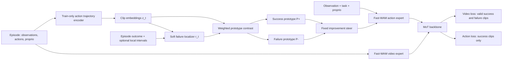

# Offline Self-Improving 设计与实验计划

更新日期：2026-07-10
工作名称：**FITWAM-Steer**（结果稳定前不作为最终论文命名）

## 0. 重新审计后的决定

当前方向成立，但原计划不能直接作为论文级实验执行。四个关键修正如下：

1. **不能把 failure episode 的所有 clip 都当负例。** 正确前缀、真正失败区间和终止后的静止尾段必须区分。
2. **主方法不能把真实 outcome token 输入 MoT。** outcome 只进入 loss；推理与训练使用相同的任务、视觉、proprio 和固定 steer 接口。
3. **先用人工局部区间验证机制，再验证自动软定位。** 自动定位没有达到局部标注指标前，不能替代人工区间成为主结果。
4. **AWS 与数据必须先过 readiness gate。** 当前成功数据可确认，failure 数据尚未完整进入 AWS 训练路径；GPU 驱动栈也必须恢复后才能估算真实吞吐。

本阶段的推荐顺序是：

```text
人工局部标签的 mechanism oracle
    -> episode 标签的 weak soft localizer
    -> failure-contrastive steer
    -> 多任务与多 seed
    -> 触觉和 online self-improving
```

## 1. 研究问题与可主张结论

本阶段只回答一个问题：

> 离线失败轨迹能否通过 failure-relevant action interval 的负监督改善 Fast-WAM 动作生成，同时不模仿失败动作、不依赖推理时 outcome、不增加 future-video planning？

只有同时满足以下条件，offline deliverable 才成立：

- 同协议优于 success-only FastWAM；
- 同协议优于 failure-video-only base；
- failed action 的 flow/BC loss 恒为零；
- 提升在去掉 steer 或打乱 failure label 后消失；
- 推理只运行一个 action policy，不输入 success/failure、failure reason 或未来视频；
- 提升不是 collector checkpoint、episode 长度、静止尾段或 test-seed 泄漏造成的。

本阶段不把 tactile、online RL、retry、AdaJEPA 式 test-time update 同时加入主模型。它们属于后续阶段。

## 2. 当前数据与算力状态

### 2.1 已确认的数据

AWS 工作根目录为 `/data_all/zhaoyc/Summer2/FITWAM`。当前已确认的标准成功数据为：

```text
data/dexjoco/multi-task-5
500 episodes
5 tasks x 100 episodes
2 cameras
action dim = 22
state/proprio dim = 23
```

任务包括 Water Plant、Hammer Nail、Fold Glasses、Pick Bucket 和 Pinch Tongs。

目前 failure 数据的事实边界：

- Water Plant、Hammer Nail、Fold Glasses 已有历史失败数据或结果记录；
- 多数失败轨迹只有 episode-level outcome 或 text marker；
- Water Plant 的部分数据有人工截断，可作为第一批局部监督；
- 旧 Water Plant failure 由 1-camera policy 采集；即使轨迹同时保存了 2-camera 视频，它仍带有 collector-policy 分布差异，不能单独作为 2-camera + proprio 主实验的 failure source；
- 预期的 LeRobot failure dataset 尚未在 AWS 训练路径完整核验，旧 relabel bundle 不能直接替代训练集。

因此训练前必须生成统一 manifest，不能依赖文件夹名或 task text 猜标签。主实验应由标准 2-camera + proprio B0 固定采样 200 条 rollout，完整保留 success，并按失败发生位置截断/标注 failure；旧 1-camera collector 数据只进入 pilot 或 source-policy ablation。

### 2.2 标签的两个等级

| 等级 | 来源 | 用途 | 能否支撑主方法 |
|---|---|---|---|
| `episode` | success/failure outcome | B1 failure-video、MIL bag label | 不能直接给每个 clip 做 contrast label |
| `local` | 人工 `failure_start/end` 或可信自动定位 | 局部 contrast、localizer 评估 | 可以 |

推荐人工标注一个小而可靠的 localization set：每个已覆盖任务先标 30-50 条 failure episode，并从 success 中抽同量审核。字段至少包括：

```text
episode_id
task
collector_checkpoint
rollout_seed
episode_outcome
failure_start
failure_end
tail_start
failure_mode
annotation_confidence
annotation_source
split
```

### 2.3 AWS readiness

GPU 使用 AWS `p4de.24xlarge`，8 张 A100 80GB；默认按两个独立 4-GPU lane 规划。正式训练前必须通过：

| Gate | 检查 |
|---|---|
| C0.1 | `nvidia-smi` 可用，8 张卡状态正常 |
| C0.2 | `torch.cuda.is_available()` 为 true，4-rank collective 正常 |
| C0.3 | DexJoCo EGL/rollout smoke 正常 |
| C0.4 | 200-step FastWAM smoke 无 OOM、NaN 或 rank 分裂 |
| C0.5 | W&B 从 step 0 记录，本地 JSONL/CSV 同步写入 |

截至本次审计，设备节点存在，但 `nvidia-smi` 缺失且 PyTorch 报 CUDA 802；该状态下不能启动正式训练。恢复 GPU 栈后先跑 200/500-step benchmark，再用实测吞吐更新时间表。

### 2.4 历史结果的证据等级

已有 Water Plant、Hammer Nail 和 Fold Glasses rollout 说明 failure-video、text outcome 和 structured outcome 都能完成训练，并且结果对 checkpoint 很敏感。这些结果是 architecture design 的 pilot evidence，不足以直接进入新方法主表，原因包括 collector policy、camera/proprio、`max_env_steps`、`replan_steps`、训练预算和 checkpoint selection 并未全部统一。

新实验不删除历史结果，但将其放在 preliminary/appendix；B0、B1、M-oracle、M-auto 必须在同一 `offline-v1` protocol 下重测。

## 3. 方法：Localize, Contrast, Steer

### 3.1 总体结构

主方法包含三个训练期组件和一个推理期 token：

1. **Clean action-trajectory encoder** `g_phi`
   - 输入归一化 action chunk，可选拼接 `delta proprio`；
   - 在 outcome/steer 注入前计算；
   - 输出 L2-normalized trajectory embedding `z_t`；
   - 只在训练时运行。

2. **Soft failure localizer** `h_psi`
   - 给每个 clip 输出 `r_t in [0,1]`；
   - 人工区间直接提供局部监督；
   - 仅有 episode label 时使用 multiple-instance learning。

3. **Success/failure prototypes** `P+`, `P-`
   - 用 success clip 和高置信 failure-local clip 学习；
   - 第一版每类 `K=1`，共享于任务；
   - `K=4`、task-specific prototype 只做后续消融。

4. **Action-side improvement steer**

   ```text
   S_improve = LayerNorm(P+ + alpha * (P+ - P-))
   ```

   `S_improve` 只追加到 action expert context；训练和推理使用同一个 token。video expert 和 action expert 都不接收真实 outcome flag。



### 3.2 人工局部监督：mechanism oracle

人工区间不是最终 scalable 方案，但它是最可靠的因果机制验证：

| 区间 | Video loss | Action loss | Localizer/contrast |
|---|---:|---:|---|
| success 有效 clip | yes | yes | positive |
| failure episode 的正确 prefix | yes | no | ignore |
| `failure_start:end` 重叠 clip | yes | no | negative |
| `tail_start` 后静止片段 | no | no | ignore |

先在 Water Plant 人工截断数据上运行 `M_oracle`。如果 oracle 都不能优于 B1，则无需先做复杂自动标注，应先否定或修改 steer 架构。

### 3.3 Episode 标签的弱监督软定位

仅有 episode outcome 时，把每条轨迹视作一组 clip：failure bag 至少包含一个失败 clip，success bag 不应包含失败 clip。

```text
r_t = sigmoid(h_psi(z_t))
R_episode = mean(top_k(r_t, k))
L_mil = BCE(R_episode, episode_outcome)
```

加入两个约束：

```text
L_smooth = mean(abs(r_t - r_(t-1)))
L_sparse = mean(r_t) on failure bags
```

总 localizer loss：

```text
L_localize = L_mil
           + lambda_sup * L_frame_on_manual_subset
           + lambda_smooth * L_smooth
           + lambda_sparse * L_sparse
```

防止 localizer 学到伪线索：

- success/failure episode 做长度匹配和随机 temporal crop；
- 静止尾段在训练前裁掉或显式 ignore；
- collector checkpoint、task、camera source 在 batch 内平衡；
- 训练一个 source/task probe，若 `z_t` 主要识别来源而不是 failure interval，则该版本不进入主实验；
- 用人工 localization set 报告 frame AUPRC、segment IoU 和 boundary F1。

`M_auto` 只有在 held-out 人工区间上显著优于 uniform episode label，并且可视化定位合理时，才作为 scalable 主方法。否则论文只报告 `M_oracle`，并明确人工局部标注依赖。

### 3.4 Failure-contrastive objective

对每个 clip 使用局部权重：

```text
w_pos = 1 for valid success clips
w_neg = r_t * confidence for failure clips
c+ = normalize(project(P+))
c- = normalize(project(P-))
logits_t = [sim(z_t, c+) / temperature,
            sim(z_t, c-) / temperature]
L_ctr = weighted_cross_entropy(logits_t, local target)
```

success/failure clip 按 task 与 normalized progress bucket 配对，避免模型只学阶段差异。prototype 仍使用共享参数，progress bucket 只用于 sampler 和 pair matching，不作为推理输入。

总损失：

```text
L = L_video(valid success + failure clips)
  + lambda_action * L_action(success clips only)
  + lambda_ctr * L_ctr
  + lambda_localize * L_localize
  + lambda_sep * max(0, margin - cosine_distance(c+, c-))
```

首轮超参数只做小范围搜索：

| 参数 | 默认 | 消融 |
|---|---:|---:|
| `alpha` | 0.5 | 0, 1.0 |
| `lambda_ctr` | 0.05 | 0.02, 0.1 |
| `lambda_localize` | 0.1 | 0.05, 0.2 |
| `temperature` | 0.1 | 固定 |
| `K` | 1 | 4，仅后续 |

### 3.5 MoT 中 failure action 的影响

`action_loss_weight=0` 只保证 failure action 没有直接 flow/BC 目标。failure sample 仍会通过 video loss、共享 MoT 和 contrast loss 间接改变 action expert；这是方法的一部分，不应表述成“action expert 完全不受 failure 影响”。

因此 B1 必须保留同样的 failure video 与 MoT forward，只去掉 contrast/localizer/steer。`M - B1` 才能隔离 action-negative steering 的增量。

## 4. 数据与泄漏控制

### 4.1 统一 manifest

EveRobot/LeRobot 过渡 manifest 至少包含：

```text
episode_id, task, dataset_source
rollout_round, collector_checkpoint, collector_commit
rollout_seed, object_config
episode_outcome
failure_start, failure_end, tail_start
failure_mode, annotation_source, annotation_version, confidence
camera_keys, proprio_schema, action_schema
train_val_test_split, protocol_version
```

### 4.2 Split

- 按 `rollout_seed + object_config + collector_checkpoint` 分组切分，不能逐 episode 随机切；
- test seed 不用于采集训练 failure；
- 同一初始状态的 success/failure 不能跨 train/test；
- 主表使用与 B0 观测配置一致的 collector；另做一次 collector-checkpoint holdout，确认模型没有记住某个旧 policy 的动作风格；
- checkpoint 选择只看 validation seeds；
- final test seeds 一次性解封，不反复选 checkpoint。

### 4.3 Sampling

训练 batch 按 task、outcome、progress bucket 平衡。必须记录实际采样比例，不能只在 config 中写目标比例。

Failure 数量先做：

```text
100 success fixed
25 / 50 / 100 failure
```

1:1 只是主设置，不预设为最优。额外加入 matched-extra-success control：用相同数量的额外 success episode 排除“只是数据更多”的解释。

## 5. 实验矩阵

### 5.1 必做基线与消融

| ID | 条件 | Failure video | Failed-action BC | Localizer | Contrast | Steer | 目的 |
|---|---|---:|---:|---:|---:|---:|---|
| B0 | FastWAM success-only | no | no | no | no | no | 标准基线 |
| B1 | Failure-video base | yes | no | no | no | no | failure video 与共享 MoT 的收益 |
| B2 | Existing outcome embedding | yes | no | oracle token | no | binary | 历史结构化版本，仅作竞争基线 |
| A0 | Token-only | yes | no | no | no | random/learned | 排除参数量与额外 token |
| A1 | Uniform episode contrast | yes | no | uniform | yes | yes | 验证整条 episode 负标的缺陷 |
| A2 | Localizer-only | yes | no | yes | no | no | 验证定位，不改变动作生成 |
| M-oracle | Manual-localized FITWAM | yes | no | manual | yes | yes | 机制上界与首个 gate |
| M-auto | Weak-localized FITWAM | yes | no | MIL + small supervised set | yes | yes | scalable 主方法候选 |
| N | M + failed-action BC | yes | yes | yes | yes | yes | 负控制，仅一个任务 |
| S | Shuffled outcome/local intervals | yes | no | shuffled | yes | yes | 标签与来源伪线索 sanity check |

B2 在推理时若固定传 `success` token，必须标成 oracle-like structured baseline，不与 action-only main method 混称。

### 5.2 分层执行，避免一次跑满矩阵

**Tier 0：基础设施与梯度测试**

- C0 readiness；
- failure-only batch 的 action BC gradient 为 0；
- localizer/projector/steer gradient 非 0；
- 移除 outcome token 后训练、部署接口一致；
- checkpoint 能保存/恢复新增模块。

**Tier 1：Water Plant mechanism gate**

- B0、B1、A0、A1、M-oracle；
- 200-step 与 2k smoke；
- 只有 M-oracle 显示合理趋势，才跑 6.5k/6.65k。

**Tier 2：自动定位与第二任务**

- 训练并验证 M-auto localizer；
- Water Plant：B1、M-oracle、M-auto；
- Hammer Nail：B0、B1、M-auto；若无人工区间，先补 30-50 条 local labels；
- 加 S label-shuffle 和 source probe。

**Tier 3：论文级多任务**

- 已覆盖任务至少 Water Plant、Hammer Nail、Fold Glasses；
- 若论文主张 5-task self-improvement，必须为 Pick Bucket、Pinch Tongs 采集并局部验证 failure；
- 即使 failure 只覆盖 3 个任务，也要评估全部 5 个 success task，报告未覆盖任务的 negative transfer；
- B0、B1、M-auto 使用 3 个 training seeds；其余消融可先 1 seed。

## 6. 统一评估协议

每个任务冻结一个 protocol JSON：

- 2 cameras + proprio；
- 相同 object randomization 和初始 seed；
- `replan_steps=25`；
- Water Plant、Fold Glasses：`max_env_steps=600`；
- Hammer Nail：`max_env_steps=1500`，同时报告 `success@600/1000/1500`；
- 相同 action horizon、normalization stats、deploy/eval commit；
- 不混用 async、LPF、额外 recovery controller 或不同 max steps。

### 6.1 Checkpoint selection

- 固定训练预算，不用 test rollout 早停；
- 6.5k/6.65k run 预注册 `5000 / 6000 / final`；
- 12.24k run 预注册 `8000 / 10000 / 12000 / final`；
- 每个候选用固定 50 validation seeds；
- 选定后在 held-out test seeds 上只跑一次主结果。

### 6.2 论文级统计

- 主表每 task/model 至少 200 个 paired initial states；若目标差异只有 4pp，应扩到 300-500；
- 报告精确 `success/N`、Wilson 95% CI、paired difference；
- 同 seed 成败比较用 McNemar test 或 paired bootstrap；
- 3 个 training seeds 的汇总不能用 rollout 方差替代训练方差；
- 多任务汇总使用 per-task macro average，并同时保留每任务结果；
- 50-episode rollout 只做 checkpoint gate，不作为最终论文结论。

### 6.3 附加指标

动作与任务：

- median success step；
- action jerk、sign-flip rate；
- failure-mode distribution；
- 未覆盖 task 的 negative transfer。

定位：

- frame AUPRC；
- segment IoU；
- boundary F1；
- uniform-label、episode-length 和 source-checkpoint controls。

表示：

- prototype cosine/distance；
- success/failure embedding 可视化；
- task/source probe accuracy；
- `alpha=0` 与 shuffled label 的差异。

## 7. Gate 与停止规则

| Gate | 通过条件 | 不通过时 |
|---|---|---|
| G0 infrastructure | C0 全通过 | 不启动正式 run |
| G1 loss correctness | failed-action BC grad=0；新增模块有 grad | 修代码，不 rollout |
| G2 oracle mechanism | M-oracle 相对 B1 有稳定正向趋势 | 停止 auto localizer，先改 steer/contrast |
| G3 localization | M-auto 在人工 held-out set 明显优于 uniform | 不把 M-auto 写成主方法 |
| G4 two-task evidence | M 同协议优于 B0/B1，且无明显负迁移 | 只保留单任务结果或否定方法 |
| G5 paper evidence | 3 tasks、3 seeds、paired final 支持主张 | 不扩张到 tactile/online claim |

推荐工程目标：已覆盖任务平均相对 B1 提升至少 4 percentage points，并且 paired interval 不支持明显退化。该数值是预注册目标，不是保证结果。

## 8. AWS 时间估算

历史记录“4 张 A100、2k steps 约 4 小时”来自旧环境，只能作为先验。AWS 恢复后先测：

```text
200-step correctness smoke
500-step throughput benchmark
checkpoint save time
50-episode rollout wall time
```

若 AWS 实测仍约 500 steps/hour/4 GPUs，则：

| 工作 | 4 GPU 单 lane | 备注 |
|---|---:|---|
| 200-step smoke | 0.5-1 h | 含启动与保存 |
| 2k smoke | 4-5 h | 只跑必要条件 |
| 6.5k/6.65k | 13-16 h/run | 两个 4-GPU lane 可并行 |
| 12.24k | 25-30 h/run | 仅通过 gate 的方法 |
| 100 rollout | 0.5-1.5 h/checkpoint | 以实测为准 |
| 200 rollout | 1-3 h/model/task | 环境稳定性影响较大 |

加入 AWS Spot、checkpoint 同步和失败重启后，训练估算统一增加 25%-35% buffer。

### 8.1 日历计划

从“GPU C0 通过且 failure 数据已 staging”开始计时：

| 时间 | 工作 |
|---|---|
| Day 1-2 | manifest/split、人工 localization set、模块实现、梯度测试 |
| Day 3 | 200/2k smoke；B1 与 M-oracle |
| Day 4-5 | Water Plant 6.5k gate；localizer 训练与审核 |
| Day 6-7 | Hammer Nail；M-auto、shuffle/source controls |
| Day 8 | 200-episode paired evaluation 与 failure-mode analysis |

**最小可信机制包：GPU/data ready 后约 7-9 天。**

论文级 3-task、3-seed、主要基线和 200-500 rollout：**约 12-18 天**；若补齐 5-task failure、重新标注或做 12k 复训，应按 **3 周以上** 规划。当前 GPU 驱动修复和 failure staging 所需时间不包含在上述区间内。

## 9. 记录与存储

每个正式 run 从 step 0 保存：

- git commit、完整 config、dataset manifest hash、protocol version；
- W&B URL；
- 本地 JSONL/CSV curves；
- `loss_video/action/contrast/localize`；
- success/failure/unknown 的实际 batch 比例；
- prototype distance、localizer score 分布、gradient norm；
- checkpoint、rollout summary、视频和 action 文件；
- stop reason。

权重 checkpoint 可用于 rollout；DeepSpeed optimizer `state` 只用于 resume。保留关键权重，optimizer state 只保留最新 1-2 份，避免 AWS/共享存储被中间 state 占满。分布式 `output_dir` 必须在 launch 前生成统一 `RUN_ID`，不能让各 rank 单独解析时间戳。

## 10. 与 Related Work 对应的实验边界

- Fast-WAM 已证明 training-side world supervision 与 action-only inference；B0/B1 说明我们的增量不是该属性本身。
- SSDF 已证明 imperfect trajectory 中有可复用片段；A1/M-oracle/M-auto 说明我们解决的是局部负监督，而不只是过滤。
- AFIL 已有双 generator negative guidance；B1/M 和 inference profile 必须证明单 generator、固定 steer 的差异。
- FAR 已有 retry 与 continual improvement；当前实验不能使用 retry/online update 来解释 offline 提升。
- $\pi_{0.7}$ 已有 metadata steering；B2/A0/M 必须隔离“有 token”与“failure contrast”的差别。
- WALL-WM 已有 event hierarchy；localizer 指标必须验证 failure-local soft score，而不能把 event annotation 当成我们的首创。
- Tactile-WAM/VT-WAM 已有 tactile WAM；未来 tactile 实验必须证明 failure/contact localization 的增量，而不只是加 tactile 模态。

## 11. 下一步执行清单

1. 修复并验证 AWS C0；
2. 把三类 failure 数据 staging 到 AWS，生成统一 manifest；
3. 从 Water Plant 选 30-50 条人工确认 `failure_start/end/tail_start`；
4. 实现无 outcome-token 的 trajectory encoder、prototype 和 action-only steer；
5. 先跑 B1 与 M-oracle 的 200/2k smoke；
6. oracle gate 通过后再实现/训练 M-auto；
7. 按 Tier 2/3 扩任务和统计，不一次启动全矩阵。

核心边界：**failure action 作为局部负表示监督，但不作为 action imitation target；推理使用固定 success-directed steer，不需要 outcome、failure generator、future video、retry 或 online reward。**
